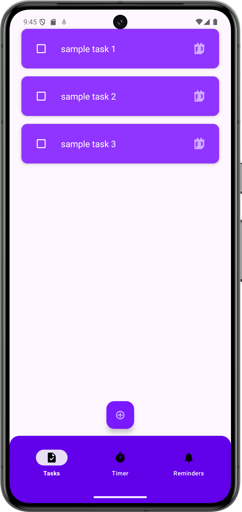
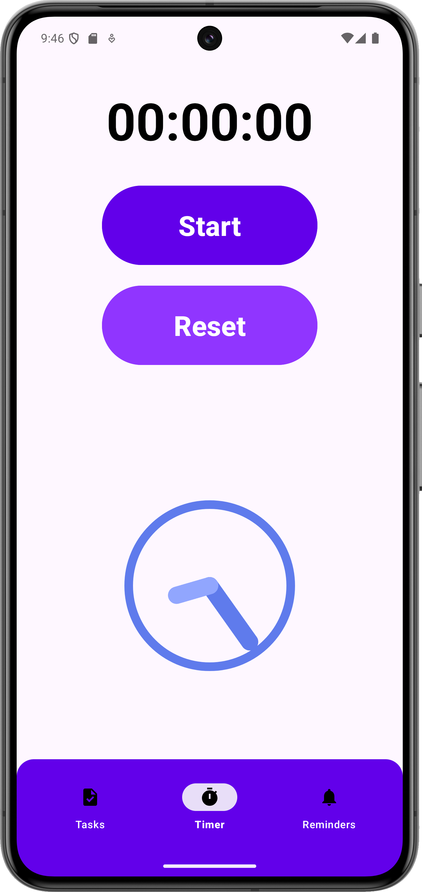
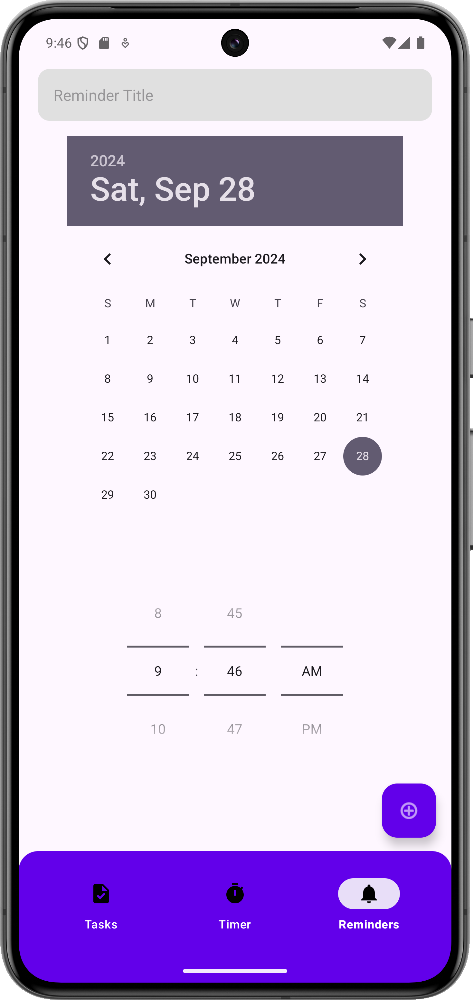
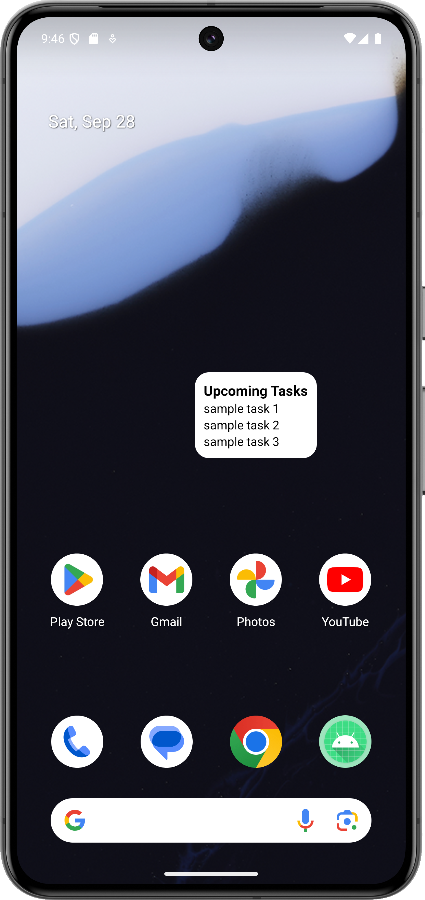

Here’s a **README** file template for your project, which you can modify and upload to GitHub:

---

# EfficientLife - Multi-Feature Productivity App

EfficientLife is an Android application designed to help users manage their daily tasks efficiently by offering a combination of task management, timers, and reminders. The app allows users to add, edit, and delete tasks, track time spent on activities, and set reminders for upcoming tasks or deadlines. It also includes a home screen widget to display upcoming tasks or reminders as an advanced feature.

---

## Features

### 1. Task Management
- Add, edit, and delete tasks from your task list.
- Mark tasks as complete with a strikethrough effect.
- Interactive task list with options to edit or delete tasks.

### 2. Timer/Stopwatch
- Track the time spent on activities with a simple and intuitive timer.
- Pause, reset, and resume timer functionality.
- Display elapsed time in hours, minutes, and seconds.

### 3. Reminder System
- Set reminders for important tasks with alarms and notifications.
- Notifications will alert you when it's time to complete a task.
- Add and manage reminders through a clean and user-friendly interface.

### 4. Home Screen Widget (Advanced Feature)
- View upcoming tasks and reminders directly on your home screen.
- Add the widget to keep track of deadlines without opening the app.

---

## Installation

1. Clone the repository:
   ```bash
   git clone https://github.com/YourUsername/EfficientLife.git
   ```

2. Open the project in Android Studio.

3. Sync the project with Gradle files to download dependencies.

4. Build and run the project on an Android device or emulator.

---

## Technologies Used

- **Android Studio**: IDE for building the app.
- **Kotlin**: Programming language for Android development.
- **RecyclerView**: For displaying the task list in a scrollable format.
- **SharedPreferences**: To save and persist tasks across app sessions.
- **Alarms and Notifications**: To remind users of important tasks.
- **Home Screen Widgets**: For displaying tasks and reminders on the home screen.

---

## Screenshots

Include screenshots of your app in action (optional but recommended). Example:

| Task List Page                         | Timer Page                      | Reminder Page                         | Home Screen Widget                |
|----------------------------------------|---------------------------------|---------------------------------------|-----------------------------------|
|  |  |  |  |

---

## How to Use

### Adding Tasks
1. Open the app and navigate to the **Task List** section.
2. Click on the Floating Action Button to add a new task.
3. Enter the task details and click **Add** to save the task.
4. Long-press on a task to edit or delete it.

### Setting a Timer
1. Navigate to the **Timer** section from the bottom navigation bar.
2. Start the timer and track the time spent on activities.
3. Pause, reset, or resume the timer as needed.

### Adding Reminders
1. Go to the **Reminder** section to create reminders.
2. Enter the reminder title, date, and time.
3. The app will notify you when the reminder is due.

### Widget Setup
1. Long-press on your home screen and select **Widgets**.
2. Look for the EfficientLife widget and drag it onto your home screen.
3. The widget will display your upcoming tasks or reminders.

---

## Upcoming Features
- Cloud sync to store tasks across multiple devices.
- Daily/weekly summaries for productivity tracking.
- Dark mode for improved user experience.

---

## License

This project is licensed under the MIT License - see the [LICENSE](LICENSE) file for details.

---

## Contributing

1. Fork the repository.
2. Create a new branch for your feature or bugfix.
3. Commit your changes.
4. Push to your branch.
5. Open a pull request.